# 🧠 VectorMind — System Architecture & RAG Documentation

VectorMind is a premium, professional-grade **Retrieval-Augmented Generation (RAG)** platform designed to enable high-performance, context-aware semantic search and chatbot assistance over custom user document vaults. 

Built using a state-of-the-art serverless architecture, VectorMind integrates **Next.js 13**, **Google Gemini**, and **Supabase (PostgreSQL + pgvector)** to offer sub-second document indexing, instant semantic search, and streaming, fully-cited AI completions.

---

## 🏛️ System Architecture Overview

The platform operates on two separate, optimized pipelines:
1. **The Ingestion Pipeline (Write-path)**: Extracts, sanitizes, chunks, embeds, and indexes document files.
2. **The RAG Query Loop (Read-path)**: Converts the user's query into an embedding, performs high-speed vector similarity matching in PostgreSQL, injects matching sections as context, and streams the answer from Gemini.

### 🔄 System Flowchart

```mermaid
flowchart TD
    subgraph Ingestion Pipeline [1. Ingestion & Indexing Pipeline]
        A[User Uploads Files] -->|Up to 100 Files| B[Next.js Client UI]
        B -->|Base64 Payload| C[API Endpoint: /api/upload]
        C -->|Raw File Save| CA[(Local Directory: public/uploads)]
        C -->|File Type check| D{Is PDF?}
        D -->|Yes| E[pdf-parse Extraction]
        D -->|No| F[UTF-8 Text Decode]
        E --> G[Sanitation: Null Bytes Stripped]
        F --> G
        G --> H[Sliding-Window Chunking: 1000 char size, 200 overlap]
        H --> I[Gemini: gemini-embedding-2]
        I -->|768-Dim Vector| J[(Supabase PostgreSQL: pgvector)]
    end

    subgraph Query Loop [2. Retrieval-Augmented Generation Query Loop]
        K[User Query] -->|Ask chatbot| L[API Endpoint: /api/vector-search]
        L --> M[Gemini: gemini-embedding-2]
        M -->|768-Dim Query Vector| N[Supabase RPC: match_page_sections]
        N -->|Fast Negated Dot Product| O[Top 10 Relevant Sections]
        O --> P[Filter & Format Context Chunks]
        P --> Q[Assemble RAG System Prompt]
        Q --> R[Gemini: gemini-2.5-flash]
        R -->|Server-Sent Events SSE| S[Next.js Client Chatbot UI]
    end
```



---

## 🛠️ Deep-Dive Algorithmic Workflow

### 1. Document Extraction & Sanitation
When a file is uploaded, the frontend reads the content into a Base64 string to prevent transmission corruption across API request boundaries.
* **PDF Processing**: Utilizes `pdf-parse` to extract clean text streams from binary PDF files page-by-page.
* **Text Processing**: Handles other text-based formats (Markdown, Code, TXT, JSON) as standard UTF-8 strings.
* **Sanitation**: PostgreSQL does not support null bytes (`\u0000`) or escaped null representations in string columns. The backend actively strips these strings (`content.replace(/\u0000/g, '').replace(/\\u0000/g, '')`) before writing to the database to prevent query failure.
* **Local Caching**: Persists a copy of the file inside `public/uploads/` to enable fast, seamless in-app document previews.

### 2. Sliding-Window Chunking
Large documents exceed LLM token limits and dilute search relevance. The platform splits text into chunks using a sliding window:
* **Chunk Size**: `1000` characters.
* **Overlap**: `200` characters (ensures sentence-level context remains intact across chunk boundaries).
* **Word Alignment**: Avoids splitting words in half by scanning for the last space character in the overlap zone (`lastIndexOf(' ', end)`) and adjusting the split boundary dynamically.
* **SHA-256 Checksums**: A checksum of the clean content is computed and verified against existing database records to skip processing duplicate uploads.

### 3. Gemini Vector Embeddings
To represent the semantic "meaning" of a text chunk, VectorMind maps it to high-dimensional coordinate spaces using **Google Gemini**:
* **Embedding Model**: `models/gemini-embedding-2` (via Gemini Embedding API).
* **Task Types**:
  * **Document Indexing**: Uses `taskType: "RETRIEVAL_DOCUMENT"`, which formats and optimizes the vector representation for database storage.
  * **User Searching**: Uses `taskType: "RETRIEVAL_QUERY"`, which formats the search vector to match document vectors.
* **Dimensionality**: `768` dimensions (highly compact and accurate).

### 4. Vector DB Similarity Matching (Supabase + pgvector)
When a user asks a question, the query is converted into a 768-dimensional vector. The system queries Supabase using the `match_page_sections` database RPC function:

```sql
create or replace function match_page_sections(
  embedding vector(768),
  match_threshold float,
  match_count int,
  min_content_length int
)
returns table (
  id bigint,
  page_id bigint,
  slug text,
  heading text,
  content text,
  similarity float
)
language plpgsql
as $$
#variable_conflict use_variable
begin
  return query
  select
    nods_page_section.id,
    nods_page_section.page_id,
    nods_page_section.slug,
    nods_page_section.heading,
    nods_page_section.content,
    (nods_page_section.embedding <#> embedding) * -1 as similarity
  from nods_page_section
  where length(nods_page_section.content) >= min_content_length
    and (nods_page_section.embedding <#> embedding) * -1 > match_threshold
  order by nods_page_section.embedding <#> embedding
  limit match_count;
end;
$$;
```

#### 🔍 Why Use Supabase & PostgreSQL `pgvector`?
* **Relational Cohesion**: Storing page metadata (filename, size, timestamps) and page sections/embeddings in a single relational DB allows seamless joins.
* **No Synchronization Delay**: Deleting a document instantly deletes all associated chunks and vectors via cascade constraints (`ON DELETE CASCADE`), ensuring no stale vectors remain.
* **Search Metric Optimization**: It uses the `<#>` operator (**Negative Dot Product**). Because Google Gemini's embeddings are L2-normalized (length = 1), **Cosine Distance** and **Negative Dot Product** yield identical similarity ranks. However, the dot product operator avoids calculating square roots, leading to faster CPU-level similarity checks.

---

## 🗄️ Database Schema

The system uses two connected relational tables in Supabase:

### 1. `nods_page` (Document Metadata)
Tracks the documents uploaded to the workspace.
```sql
create table "public"."nods_page" (
  id bigserial primary key,
  parent_page_id bigint references public.nods_page,
  path text not null unique,
  checksum text,
  meta jsonb,
  type text,
  source text
);
```

### 2. `nods_page_section` (Document Chunks & Embeddings)
Stores document chunks and their high-dimensional vector embeddings.
```sql
create table "public"."nods_page_section" (
  id bigserial primary key,
  page_id bigint not null references public.nods_page on delete cascade,
  content text,
  token_count int,
  embedding vector(768),
  slug text,
  heading text
);
```

---

## 🧰 Technology Stack & Libraries

### Core Architecture
* **Next.js (v13.2)**: Framework for API routing, edge handlers, and visual components.
* **TypeScript**: Strict type definitions for full system safety.
* **TailwindCSS**: Premium responsive UI design with customized dark animations.
* **Lucide React**: Modern, clean iconography throughout the workspace.

### Vector & AI Integrations
* **Google Gemini API**:
  * `gemini-embedding-2` for creating 768-dimensional vectors.
  * `gemini-2.5-flash` for lighting-fast context-grounded streaming completions.
* **Supabase Client SDK (`@supabase/supabase-js`)**: High-performance database client used to fetch metadata, delete files, and run similarity RPC queries.
* **Vercel AI SDK (`ai`)**: High-performance streaming handlers used to parse SSE channels and feed streaming responses to the frontend.

### Parsers & Helpers
* **pdf-parse**: A high-performance PDF parser used to extract raw content.
* **gpt3-tokenizer**: Standardized token count measurement to optimize sliding window size and keep LLM context bounds within limits.
* **mdast-util-from-markdown**: Parser used to compile Markdown into Abstract Syntax Trees (ASTs) to chunk documentation semantically by heading tags (H1/H2/H3).

---

## 📑 Supported Formats

VectorMind supports parsing, indexing, and embedding a wide range of developer and document formats:
* **Portable Documents**: `.pdf`
* **Markdown & Guides**: `.md`, `.mdx`
* **Structured Data**: `.json`, `.csv`, `.yaml`, `.yml`, `.xml`
* **Source Code Files**: `.js`, `.jsx`, `.ts`, `.tsx`, `.html`, `.css`, `.py`, `.go`, `.sh`
* **Plain Text**: `.txt`

---

## 🔑 Required API Keys & Environment Variables

To run the system locally or in cloud hosting, create a `.env` file at the root of the project with the following keys:

```ini
# Google AI Studio API Key (For embeddings & chat completions)
GEMINI_API_KEY=your_gemini_api_key_here

# Supabase Configurations
NEXT_PUBLIC_SUPABASE_URL=https://your-supabase-id.supabase.co
NEXT_PUBLIC_SUPABASE_ANON_KEY=your_client_anon_key_here
SUPABASE_SERVICE_ROLE_KEY=your_private_service_role_key_here
```

---

## 🚀 Getting Started & Local Setup

### 1. Install Dependencies
```bash
npm install
```

### 2. Set Up the Database
Execute the SQL commands in `supabase/migrations/20230406025118_init.sql` inside your Supabase SQL editor to create the tables, vector extension, and vector similarity search function.

### 3. Generate Static Embeddings
To index markdown files pre-placed inside your `pages` folder:
```bash
npm run embeddings
```

### 4. Run Development Server
```bash
npm run dev
```
Open `http://localhost:3000` to start using your VectorMind workspace!
