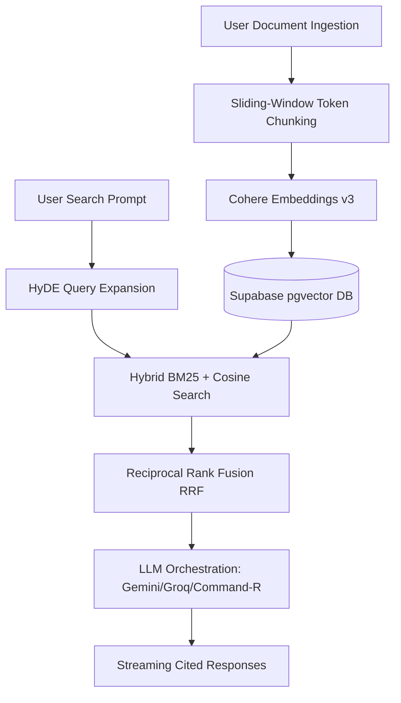

# ⚡ VectorMind

<div align="center">
  
  <br /><br />
  
  [](https://nextjs.org/)
  [](https://github.com/pgvector/pgvector)
  [](#progressive-web-app-pwa)
  [](#)

  <h3>Premium, Enterprise-Grade Hybrid RAG & CAG Document Intelligence Platform</h3>

  <p>
    <a href="#-system-architecture">Architecture</a> •
    <a href="#-hybrid-rag-vs-cag">RAG vs CAG</a> •
    <a href="#-key-features">Key Features</a> •
    <a href="#%EF%B8%8F-installation--quickstart">Quickstart</a> •
    <a href="#-pwa-standalone">PWA App</a>
  </p>
</div>

---

## 🧠 System Architecture

VectorMind is a highly-optimized, production-scale intelligence platform that supports both **Retrieval-Augmented Generation (RAG)** and **Cache-Augmented Generation (CAG)** workflows. It allows teams to orchestrate natural-language chat pipelines over complex corporate knowledge vaults with zero hallucinations.



### 🔄 Dual-Pipeline Engineering

1. **The Ingestion Pipeline (Write-Path):**
   * **Parsing & Extraction:** Auto-detects and digests `.pdf`, `.docx`, `.md`, `.json`, `.ts`, `.py`, and standard `.txt` files.
   * **Semantic Chunking:** Splits documents using a sliding-window token limits tokenizer, keeping document structural metadata intact.
   * **Vector Embedding:** Generates high-density dimensional embeddings via models like Cohere v3 or OpenAI.
   * **Storage Layer:** Populates a `pgvector`-enabled Supabase database using custom HNSW similarity indexes.

2. **The Retrieval Loop (Read-Path):**
   * **HyDE (Hypothetical Document Embeddings):** Expands the query space by generating draft replies, maximizing document hit rates.
   * **Hybrid Search:** Queries the PostgreSQL database with combined BM25 keyword weights and vector cosine similarity.
   * **Rank Fusion (RRF):** Applies Reciprocal Rank Fusion to merge structured and vector lookup streams, returning only top-relevance context blocks.
   * **Context Streaming:** Compresses the token context and streams responses directly back to the interface with source-citations.

---

## ⚡ Hybrid RAG vs CAG

VectorMind implements a unified workspace architecture to combine the strengths of both paradigms:

| Metric | Retrieval-Augmented Generation (RAG) | Cache-Augmented Generation (CAG) |
| :--- | :--- | :--- |
| **Concept** | Retrieves chunks dynamically on-demand from a vector database for each user prompt. | Pre-loads full contexts or databases directly into the LLM's extended context cache windows. |
| **Ideal For** | Massive knowledge bases (10,000+ pages), dynamic files, and cost-efficient scaling. | Highly analytical sessions requiring deep synthesis across multiple full documents. |
| **Latency** | Dynamic retrieval takes 100ms - 200ms before sending context to the LLM. | Context is instantly loaded in cache; response begins streaming almost immediately. |
| **VectorMind Integration** | Activates dynamic pgvector similarity lookup. Toggle **"Strict RAG Mode"** in the sidebar controls. | Pre-caches selected document contexts into the active chat session context window. |

---

## 💎 Key Features

* **ChatGPT-Style UX:** A borderless, minimalist chat interface with right-aligned speech pills, circular bot avatar support, and raw typographic grids.
* **Ultra-Responsive (Down to 290px):** Meticulously scaled layout margins, fluid paddings, and dynamic filename table truncations designed for perfect display on mobile viewports.
* **Ambient Fading Transitions:** The animated green `gemini-glow` background radial gradient fades smoothly to a solid premium Google-Gemini style background (`#131314`) after the first prompt to maximize readability.
* **Dynamic Multi-Provider Selector:** Instantly swap between Google Gemini 2.5 Flash, Groq Llama 3, Cohere Command-R, and OpenAI models in active conversation.
* **Selective Context File Picker:** Limit or expand search filters on the fly to target specific files.
* **Workspaces Hub:** Organize document categories by independent workspaces, each configured with specific embedding and LLM defaults.

---

## 📱 PWA Standalone App

VectorMind is a fully compliant **Progressive Web App (PWA)**. 

* **Native Window Container:** Saves as a standalone desktop or mobile application on Mac, Windows, Linux, iOS, and Android.
* **Offline Resilience:** Leverages a custom service worker (`public/sw.js`) that caches static assets and platform pages.
* **Lightning Bolt Branding:** Uses your official glowing green lightning bolt vector logo (`vectormind-icon.svg`) as the home screen identity icon.
* **Dual Action Installers:** Provides a pulsing download action button in the leftmost navigation rail, and a distinct install banner in the right workspace drawer.

---

## 🛠️ Installation & Quickstart

### 1. Prerequisites
Ensure you have Node.js (v18+) and a PostgreSQL instance with the `pgvector` extension (e.g. Supabase).

### 2. Clone and Install Dependencies
```bash
git clone https://github.com/krishsoni15/VectorMind.git
cd VectorMind
npm install
```

### 3. Database Schema Setup
Execute the following statements in your Supabase SQL editor to deploy the vector tables:

```sql
-- Enable the pgvector extension
create extension if not exists vector;

-- Document Metadata Table
create table "public"."nods_page" (
  id bigserial primary key,
  project_id text not null,
  path text not null,
  checksum text,
  meta jsonb,
  type text
);

-- Vector Embedding Chunks Table
create table "public"."nods_page_section" (
  id bigserial primary key,
  page_id bigint not null references public.nods_page on delete cascade,
  content text,
  token_count int,
  embedding vector(768), -- Match with your embedding dimension size (768/1536)
  chunk_level int
);

-- Fast similarity index (HNSW Cosine)
create index on public.nods_page_section using hnsw (embedding vector_cosine_ops);
```

### 4. Setup Environment Keys
Create a `.env.local` file in your root directory:
```ini
NEXT_PUBLIC_SUPABASE_URL=your_supabase_project_url
NEXT_PUBLIC_SUPABASE_ANON_KEY=your_supabase_anon_key
SUPABASE_SERVICE_ROLE_KEY=your_supabase_service_role_key

# Model APIs
GEMINI_API_KEY=your_gemini_api_key
COHERE_API_KEY=your_cohere_api_key
GROQ_API_KEY=your_groq_api_key
OPENAI_API_KEY=your_openai_api_key
```

### 5. Launch local server
```bash
npm run dev
```
Open `http://localhost:3000` to access the production-grade dashboard.

---

## 🤖 Advanced RAG System Auto-Analysis Prompt

For developers looking to refactor, expand, or optimize the VectorMind repository:

<details>
<summary><b>Click to expand the Automated Analysis System Prompt</b></summary>

```text
# Advanced RAG Project Auto-Analysis System Prompt

## Role
You are an elite AI Software Architect, Senior RAG Engineer, AI Researcher, Vector Database Expert, Backend Engineer, and Code Intelligence System.
Your task is to automatically analyze, understand, improve, debug, optimize, and explain an entire RAG (Retrieval-Augmented Generation) project.

You must deeply inspect:
* Full codebase, PDF processing pipeline, and Vector schemas.
* Chunking strategies and metadata filtering algorithms.
* HyDE query expansions and RRF rank fusion metrics.
* Streaming context pipelines and token utilization.

Expected Output Format:
1. Architectural Flow Summary
2. Latency/Hallucination Problem Detections
3. Code Refactoring Proposals
4. Production Scalability Reports
```

</details>

---
*Built for production scale by elite AI engineers.*
