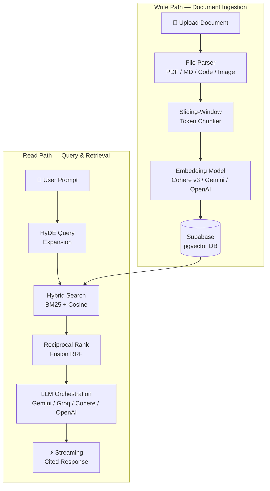

# ⚡ VectorMind

<div align="center">
  
  <br /><br />

  [](https://nextjs.org/)
  [](https://supabase.com/)
  [](https://www.typescriptlang.org/)
  [](#-progressive-web-app)
  [](LICENSE)

  <h3>Enterprise-Grade Hybrid RAG & CAG Document Intelligence Platform</h3>

  <p>
    Upload documents. Ask questions. Get cited, grounded answers — powered by your choice of AI provider.
  </p>

  <p>
    <a href="#-architecture">Architecture</a> •
    <a href="#-key-features">Features</a> •
    <a href="#%EF%B8%8F-quickstart">Quickstart</a> •
    <a href="#-api-reference">API</a> •
    <a href="#-future-roadmap">Roadmap</a>
  </p>
</div>

---

## 📖 What is VectorMind?

VectorMind is a self-hosted, multi-provider **Retrieval-Augmented Generation (RAG)** and **Cache-Augmented Generation (CAG)** platform. Upload any document (PDF, Markdown, code, images), and VectorMind chunks it, embeds it into a PostgreSQL vector database, and lets you chat with your data using any AI model — with full source citations.

**Key differentiators:**
- **Bring Your Own Keys (BYOK):** Use free-tier API keys from Google Gemini, Cohere, Groq, or OpenAI — switch providers mid-conversation
- **Per-User Workspace Isolation:** Each user gets their own isolated workspaces and documents, even guest users
- **Hybrid Search:** Combines BM25 keyword matching with vector cosine similarity via Reciprocal Rank Fusion (RRF)
- **Zero Hallucination Design:** Every response is grounded in your uploaded documents with citation links
- **Multi-Format OCR:** Extracts text from images (PNG, JPG, WebP, BMP, GIF) using Gemini Vision

---

## 🧠 Architecture

VectorMind operates on a dual-pipeline architecture:


```mermaid
graph TD
    subgraph "Write Path — Document Ingestion"
        A[📄 Upload Document] --> B[File Parser<br/>PDF / MD / Code / Image]
        B --> C[Sliding-Window<br/>Token Chunker]
        C --> D[Embedding Model<br/>Cohere v3 / Gemini / OpenAI]
        D --> E[(Supabase<br/>pgvector DB)]
    end

    subgraph "Read Path — Query & Retrieval"
        F[💬 User Prompt] --> G[HyDE Query<br/>Expansion]
        G --> H[Hybrid Search<br/>BM25 + Cosine]
        E --> H
        H --> I[Reciprocal Rank<br/>Fusion RRF]
        I --> J[LLM Orchestration<br/>Gemini / Groq / Cohere / OpenAI]
        J --> K[⚡ Streaming<br/>Cited Response]
    end
```

### Write Path (Ingestion)
1. **Parse & Extract** — Auto-detects file type (`.pdf`, `.md`, `.json`, `.ts`, `.py`, `.txt`, `.png`, `.jpg`, `.webp`, `.bmp`, `.gif`). Images processed via Gemini Vision OCR
2. **Chunk** — Splits into overlapping token-windowed chunks preserving structural metadata
3. **Embed** — Generates dense vector embeddings via Cohere embed-v3, Gemini, or OpenAI
4. **Store** — Inserts vectors into a Supabase PostgreSQL database with HNSW cosine indexes

### Read Path (Retrieval)
1. **HyDE Expansion** — Generates hypothetical answer drafts to expand the query space
2. **Hybrid Search** — Runs parallel BM25 keyword + vector cosine similarity queries
3. **Rank Fusion (RRF)** — Merges both result streams using Reciprocal Rank Fusion
4. **Stream** — Compresses context and streams LLM responses with inline source citations

---

## ⚡ Hybrid RAG vs CAG

| Aspect | RAG (Retrieval-Augmented) | CAG (Cache-Augmented) |
| :--- | :--- | :--- |
| **How it works** | Dynamically retrieves relevant chunks from the vector database per query | Pre-loads full document contexts into the LLM's extended context window |
| **Best for** | Large knowledge bases (1000+ pages), cost-efficient scaling | Deep analytical sessions across fewer documents |
| **Latency** | ~100–200ms retrieval before LLM response | Instant — context already loaded in session |
| **Toggle** | Enable **Strict RAG Mode** in sidebar controls | Pre-cache selected files into active chat session |

---

## 💎 Key Features

### AI & Search
- **Multi-Provider Model Switching** — Swap between Google Gemini, Groq (Llama 3.3 70B), Cohere Command-R+, and OpenAI GPT-4o mid-conversation
- **Hybrid Vector + Keyword Search** — BM25 full-text + pgvector cosine similarity with RRF merging
- **HyDE Query Expansion** — Hypothetical Document Embeddings for higher recall
- **Multimodal Vision OCR** — Extract text from images via Gemini 2.5 Flash Vision
- **Grounding Scores** — Each response includes a factual grounding confidence metric
- **Semantic Caching** — Upstash Vector-based response cache for repeated queries
- **Token Usage Tracking** — Real-time token consumption metrics per session

### Documents & Workspaces
- **Multi-Format Upload** — PDF, Markdown, JSON, TypeScript, Python, plain text, images
- **Workspace Isolation** — Independent workspaces with their own documents, embeddings, and provider defaults
- **Per-User Data** — Authenticated users get fully isolated workspaces; guest users share a default workspace
- **File-Level Chunk Grouping** — Chunks are attributed to their exact source file, not arbitrary labels
- **Selective Context Filtering** — Target specific uploaded files when querying

### UX & Design
- **ChatGPT-Style Interface** — Minimalist, dark-mode chat with streaming responses
- **Ultra-Responsive (290px+)** — Pixel-perfect layout from desktop to mobile
- **Glassmorphism UI** — Premium backdrop-blur panels with emerald accent gradients
- **Ambient Transitions** — Animated green glow fades to solid dark background after first interaction
- **PWA Installable** — Add to Home Screen on iOS, Android, Mac, Windows, Linux

### Security & Auth
- **Supabase Auth** — Email/password authentication with session management
- **Guest Access** — Try VectorMind without creating an account
- **BYOK Encryption** — User-provided API keys are encrypted at rest (AES-256)
- **Row-Level Security** — Supabase RLS policies for database access control
- **Rate Limiting** — Upstash Redis-based request throttling

---

## 🛠️ Quickstart

### Prerequisites
- **Node.js** v18+
- **Supabase** project with `pgvector` extension (free tier works)
- At least **one AI provider key** (Gemini, Cohere, or Groq — all have free tiers)

### 1. Clone & Install

```bash
git clone https://github.com/krishsoni15/VectorMind.git
cd VectorMind
npm install
```

### 2. Database Setup

Open your Supabase Dashboard → **SQL Editor** and run the contents of [`supabase/schema.sql`](supabase/schema.sql):

```bash
# Or copy/paste the file contents into the SQL Editor
cat supabase/schema.sql
```

This creates all tables (`nods_project`, `nods_page`, `nods_page_section`), HNSW indexes, hybrid search functions, and RLS policies.

### 3. Environment Variables

Copy the example and fill in your keys:

```bash
cp .env.example .env.local
```

```ini
# Required — Supabase
NEXT_PUBLIC_SUPABASE_URL=https://your-project.supabase.co
NEXT_PUBLIC_SUPABASE_ANON_KEY=your_anon_key
SUPABASE_SERVICE_ROLE_KEY=your_service_role_key

# AI Providers (at least one required)
GEMINI_API_KEY=          # Free at https://ai.google.dev
COHERE_API_KEY=          # Free at https://dashboard.cohere.com
GROQ_API_KEY=            # Free at https://console.groq.com
OPENAI_API_KEY=          # Paid at https://platform.openai.com

# Optional — Performance
UPSTASH_REDIS_REST_URL=  # Rate limiting
UPSTASH_REDIS_REST_TOKEN=
UPSTASH_VECTOR_REST_URL= # Semantic cache
UPSTASH_VECTOR_REST_TOKEN=
CREDENTIAL_ENCRYPTION_KEY= # 32-byte hex for BYOK encryption
```

### 4. Launch

```bash
npm run dev
```

Open **http://localhost:3000** → Sign up or continue as Guest → Upload a document → Start chatting!

---

## 🔗 API Reference

All API routes are in `pages/api/`. Authentication is handled via Supabase session cookies and `x-user-email` headers.

| Endpoint | Method | Description |
| :--- | :--- | :--- |
| `/api/projects-new` | `GET` | List all workspaces for the authenticated user |
| `/api/projects-new` | `POST` | Create a new workspace |
| `/api/projects-new` | `PUT` | Update workspace name or provider settings |
| `/api/projects-new` | `DELETE` | Delete a workspace |
| `/api/projects/[id]` | `GET` | Fetch a single workspace by ID |
| `/api/workspaces` | `GET/POST/PUT/DELETE` | Validated workspace CRUD (with rate limiting) |
| `/api/upload` | `POST` | Upload and embed a document (multipart/form-data) |
| `/api/documents` | `GET/DELETE` | List or delete documents in a workspace |
| `/api/chat` | `POST` | Send a chat message and stream the AI response |
| `/api/vector-search` | `POST` | Execute a hybrid vector + keyword search |
| `/api/auth/user` | `GET` | Get current authenticated user info |
| `/api/auth/provider-keys` | `GET/POST` | Manage user's personal AI API keys (BYOK) |
| `/api/preview/[filename]` | `GET` | Preview an uploaded document |
| `/api/proxy` | `GET` | Proxy external resources for iframe embedding |
| `/api/test-apis` | `GET` | Health check for all configured AI providers |

---

## 📁 Project Structure

```
VectorMind/
├── components/              # Reusable React components
│   ├── AccountMenu.tsx      # User account dropdown
│   ├── AIOutput.tsx         # Chat message renderer with citations
│   ├── ModelSelector.tsx    # AI provider/model picker
│   ├── SettingsModal.tsx    # Settings panel (providers, keys, theme)
│   └── TokenUsage.tsx       # Token consumption metrics display
├── lib/                     # Core business logic
│   ├── AuthContext.tsx      # React auth context (Supabase sessions)
│   ├── chunker.ts           # Sliding-window token chunker
│   ├── credentialResolver.ts # BYOK key resolution
│   ├── encryption.ts        # AES-256 encryption for stored keys
│   ├── generate-embeddings.ts # CLI embedding generator
│   ├── groundingScore.ts    # Factual grounding confidence scorer
│   ├── ocr.ts               # Gemini Vision OCR extraction
│   ├── providers.ts         # Provider registry (models, endpoints, configs)
│   ├── rateLimiter.ts       # Upstash Redis rate limiter
│   ├── retrieval.ts         # HyDE + hybrid search retrieval pipeline
│   ├── semanticCache.ts     # Upstash Vector semantic response cache
│   ├── supabase.ts          # Supabase client + user isolation helpers
│   ├── tokenTracker.ts      # Token usage accounting
│   ├── utils.ts             # Shared utilities
│   └── validateRequest.ts   # Zod request validation schemas
├── pages/
│   ├── api/                 # Next.js API routes (serverless functions)
│   ├── app/
│   │   └── index.tsx        # Main application dashboard (3900+ lines)
│   ├── index.tsx            # Landing page
│   ├── login.tsx            # Login page
│   ├── signup.tsx           # Registration page
│   ├── account.tsx          # Account management
│   ├── 404.tsx              # Custom 404 page
│   ├── _app.tsx             # App wrapper (AuthProvider, PWA, meta)
│   └── _document.tsx        # Custom document head
├── public/
│   ├── manifest.json        # PWA manifest
│   ├── sw.js                # Service worker for offline caching
│   └── vectormind-icon.svg  # App icon
├── styles/
│   └── globals.css          # Global styles + Tailwind base
├── supabase/
│   └── schema.sql           # Complete database schema (run in SQL Editor)
├── .env.example             # Environment variable template
├── package.json             # Dependencies and scripts
└── README.md                # This file
```

---

## 📱 Progressive Web App

VectorMind is a fully compliant PWA:

- **Installable** — "Add to Home Screen" on iOS, Android, Mac, Windows, Linux
- **Offline-Ready** — Service worker caches static assets and platform pages
- **Native Feel** — Opens in a standalone window without browser chrome
- **Themed** — Uses the VectorMind emerald lightning bolt icon as app identity

To install: Open VectorMind in your browser → Click the install icon in the address bar (or use the download button in the sidebar).

---

## 🔐 Authentication Flow

```mermaid
graph LR
    A[Landing Page /] --> B{User Choice}
    B -->|Sign Up| C[/signup → Create Account]
    B -->|Sign In| D[/login → Email + Password]
    B -->|Guest| E[/app → Guest Session]
    C --> F[Supabase Auth]
    D --> F
    F --> G[/app — Isolated Workspace]
    E --> G
```

- **Registered Users** — Full Supabase auth with email/password. Each user's workspaces and documents are completely isolated via server-side tag filtering
- **Guest Users** — Access the platform immediately without registration. Guest data uses a shared default workspace
- **Session Persistence** — Auth tokens stored in HTTP cookies + localStorage for seamless page reloads

---

## ⚙️ Environment Variables

| Variable | Required | Description |
| :--- | :--- | :--- |
| `NEXT_PUBLIC_SUPABASE_URL` | ✅ | Your Supabase project URL |
| `NEXT_PUBLIC_SUPABASE_ANON_KEY` | ✅ | Supabase anonymous/public key |
| `SUPABASE_SERVICE_ROLE_KEY` | ✅ | Supabase service role key (server-side only) |
| `GEMINI_API_KEY` | One of these | Google Gemini API key |
| `COHERE_API_KEY` | One of these | Cohere API key |
| `GROQ_API_KEY` | One of these | Groq API key |
| `OPENAI_API_KEY` | Optional | OpenAI API key |
| `UPSTASH_REDIS_REST_URL` | Optional | Upstash Redis URL for rate limiting |
| `UPSTASH_REDIS_REST_TOKEN` | Optional | Upstash Redis token |
| `UPSTASH_VECTOR_REST_URL` | Optional | Upstash Vector URL for semantic caching |
| `UPSTASH_VECTOR_REST_TOKEN` | Optional | Upstash Vector token |
| `CREDENTIAL_ENCRYPTION_KEY` | Optional | 32-byte hex key for encrypting user API keys |

---

## 🚀 Future Roadmap

### 🖥️ AI Code Server
Serve code-based applications on any device directly via natural language prompts. Write a prompt → VectorMind generates, runs, and serves the app — accessible on phone, tablet, or desktop without local tooling.

### 📸 Media Intelligence Engine
AI-powered image and screenshot analysis with auto-upload. Drop a screenshot → VectorMind extracts text, understands UI layouts, analyzes diagrams, and indexes everything into your knowledge base.

### 📱 Mobile-First App Builder
Generate full mobile-ready applications from a single prompt. Describe what you need → get a working app served directly to your device, complete with data persistence and AI capabilities.

### 🎬 Multi-Modal Document Intelligence
Extend beyond text and images to support:
- **Video** — Extract transcripts, key frames, and visual summaries
- **Audio** — Speech-to-text transcription with speaker diarization
- **3D Files** — CAD/model analysis and metadata extraction
- **Spreadsheets** — Structured data ingestion from Excel/CSV with schema inference

### 👥 Collaborative Workspaces
Real-time team collaboration features:
- Shared workspaces with role-based access (owner, editor, viewer)
- Live cursor presence and concurrent chat sessions
- Workspace-level activity audit logs
- Team-wide document and conversation search

### 🧩 Plugin & Extension System
Extensible architecture for custom integrations:
- Custom data source connectors (Notion, Google Drive, Confluence, Slack)
- Webhook triggers for document upload events
- Custom pre/post-processing pipelines for domain-specific data
- Third-party LLM endpoint adapters

### 🏠 Self-Hosted LLM Support
Run VectorMind with fully local, private AI models:
- **Ollama** integration for local Llama, Mistral, Phi models
- **vLLM** support for high-throughput production inference
- **HuggingFace** Transformers for custom fine-tuned models
- Zero data leaves your infrastructure

### 📤 Export & Data Portability
Full data ownership and portability:
- Export conversations as Markdown, PDF, or JSON
- Bulk export workspace documents and embeddings
- Import/export workspace configurations for migration
- API-based data extraction for custom integrations

### 🔄 Advanced RAG Techniques
- **Agentic RAG** — Multi-step reasoning with tool use over documents
- **GraphRAG** — Knowledge graph construction from document relationships
- **Corrective RAG** — Self-validating retrieval with hallucination detection
- **Adaptive Chunking** — Context-aware chunk sizing based on document structure

---

## 🤝 Contributing

1. Fork the repository
2. Create a feature branch (`git checkout -b feature/amazing-feature`)
3. Commit your changes (`git commit -m 'Add amazing feature'`)
4. Push to the branch (`git push origin feature/amazing-feature`)
5. Open a Pull Request

---

## 📄 License

Distributed under the MIT License. See [`LICENSE`](LICENSE) for details.

---

<div align="center">
  <sub>Built with ⚡ by <a href="https://github.com/krishsoni15">Krish Soni</a></sub>
</div>
